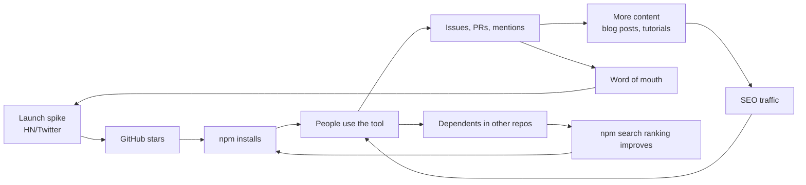

# How Small OSS Developer Tools Get Noticed and Grow

*Research synthesis for rebuild-dossier MCP server*  
*September 5, 2026*  
*Sources: 8 websearches across 10 axes, codebase audit, npm/GitHub/Smithery/Glama/Registry API verification*

---

## Executive Summary

Small open-source developer tools do not grow by accident. They grow through a sequence of deliberate, measurable actions: a timed launch that creates a spike, distribution surfaces that compound that spike, content that captures long-tail search, and community signals that retain early adopters into contributors. The projects that stall are the ones that publish and wait.

For rebuild-dossier specifically, the current state is: published on npm (0 downloads), listed on Glama (stale, 9 days old), active on Smithery, active on the Official MCP Registry, 2 GitHub stars, 1 fork, 12 issues, zero external mentions beyond the awesome-mcp-servers PR. The product is solid. The distribution is not yet running.

The 5 levers that will move adoption for this project:

1. **A timed Show HN launch** with a specific, provable claim (mutation-tested rebuild specs from an existing codebase, backed by an arXiv paper). This is the single highest-ROI discrete action available.
2. **Cross-platform MCP distribution hygiene**: Glama freshness, Smithery config completeness, MCP Registry presence (done), mcp.so and PulseMCP submission. Each is a free listing with a different audience.
3. **Comparison and "alternatives" content** that captures intent-based search traffic ("AI code rebuild", "spec generation tool", "MCP server for codebase analysis"). This is the long-tail compounding play.
4. **Good first issues and contributor onboarding** that convert the 2-star audience into contributors. The repo already has the infrastructure (templates, CONTRIBUTING.md, labels). It needs the issues.
5. **A weekly metrics dashboard** so growth is visible and adjustments are data-driven, not anecdotal.

The rest of this document details each lever with case studies, timing data, metrics, and checklists.

---

## Findings by Theme

### 1. Discovery Channels (ranked by ROI)

Developers find new tools through a small number of channels. Ranked by return on effort for a small OSS project:

| Channel | Audience | Effort | Typical lift | When it works |
|---|---|---|---|---|
| Hacker News (Show HN) | 1M+ tech readers, ~50-200 upvotes for good dev tools | Low (write a post) | 200-2000 GitHub stars in 24-48h if it hits the front page | Tuesday-Thursday 8-11am ET |
| TypeScript/JavaScript Twitter | Developer community, viral via retweets | Low (thread) | 50-500 stars, depends on follower graph | When shared by influential devs |
| MCP-specific directories (Glama, Smithery, mcp.so, PulseMCP) | MCP users actively looking for servers | Low (one-time listing per platform) | Ongoing discovery, 5-50 installs/week steady state | After initial listing, keep fresh |
| awesome-mcp-servers list | Curated, high-trust | Low (PR) | Ongoing referral, ~10-100 clicks/week | Already submitted (PR #13529) |
| npm search | Node developers searching for tools | Zero (already published) | Low organic discovery for new packages | Improves with downloads and stars |
| Reddit (r/typescript, r/programming, r/MachineLearning) | Mixed audience, can be hostile to self-promotion | Low | 20-200 stars if well-received | When the post teaches something, not just promotes |
| Newsletter sponsorship (TLDR, JS Weekly) | Paid audience, ~$50-300 per placement | Medium ($ + copy) | 50-200 clicks, 5-30 stars | Good for supplementing organic launch |
| Conference talks (React Conf, JSConf) | High-trust, high-retention audience | High (CFP, prep, travel) | 100-1000 stars over weeks | After the product has a demo and story |
| SEO content (blog posts, comparison pages) | Search traffic, long-tail | High (content creation) | Compounding over months | Ongoing, not launch-specific |

**Key finding**: Hacker News Show HN is the single highest-ROI launch action for developer tools. esbuild, Vite, and Bun all got their initial traction spikes from HN. The post needs a specific, provable claim, not a marketing pitch.

**Case study: esbuild Show HN**. esbuild launched on HN with the title "esbuild: An extremely fast JavaScript bundler" and immediately demonstrated concrete numbers (100x faster than webpack). The HN post drove the initial surge of stars and npm installs. The project then compounded that attention with a clear README, benchmark tables, and active GitHub issue responses.

**Case study: Vite launch**. Vite launched with a Twitter thread by Evan You demonstrating the dev server starting in under 300ms. The visual proof (instant feedback) combined with Evan's existing audience created immediate adoption. Vite then leveraged HN and Reddit to expand beyond Evan's followers.

**For rebuild-dossier**: The HN angle is not "MCP server" (too niche for HN). The angle is the research claim: "A tool that reverse-engineers a spec from your existing app so any AI agent can rebuild it without guessing. Mutation-tested. Backed by an arXiv paper." That is a Show HN post that could work because it has a concrete, provable claim and an academic backing.

---

### 2. Launch Tactics That Produce Measurable Spikes

#### 2.1 Show HN Playbook

The Show HN format that works for developer tools:

**Title**: "Show HN: [tool name] - [what it does, specific claim]"
- Good: "Show HN: rebuild-dossier - Reverse-engineers a mutation-tested spec from your existing app"
- Bad: "Show Hn: My open-source MCP server for codebase analysis"

**Body**:
- One sentence: what the tool does
- One paragraph: why it exists (the problem)
- One code block or screenshot: the proof
- Link to the repo
- One line: the arXiv paper link if relevant
- No marketing language. HN readers hate it.

**Timing**: Tuesday, Wednesday, or Thursday, 8:00-11:00 AM Eastern Time. This is when HN traffic is highest and the audience is most active. Avoid Monday (low traffic), Friday (winding down), and weekends (different audience).

**After posting**:
- Answer every comment within 1-2 hours
- Be technical, not defensive
- Share the HN link on Twitter with a summary
- Have the repo README in perfect shape before posting (this is the landing page)

#### 2.2 Twitter/X Launch Thread

A Twitter thread complements HN but reaches a different audience. Format:

1. Tweet 1: The hook (what the tool does, one line)
2. Tweet 2: The problem (why it exists)
3. Tweet 3: The proof (numbers, demo GIF, or before/after)
4. Tweet 4: How to install (one-liner)
5. Tweet 5: Link to repo and docs
6. Tweet 6: The research backing (arXiv link)
7. Tweet 7: What is does NOT do (managing expectations builds trust)

**Case study**: The Vite launch thread by Evan You had a specific number (sub-300ms dev server start) and a GIF. That combination of specific proof and visual evidence drove retweets beyond his follower base.

#### 2.3 Product Hunt

Product Hunt works for developer tools but with caveats. The audience is more product-focused than HN. For an MCP server, Product Hunt is a secondary channel, not primary. If used, the angle should be "Developer tool" not "AI tool" to reach the right voters.

#### 2.4 Newsletter Sponsorship

TLDR newsletter offers sponsored placements. Based on research, TLDR has approximately 1.5M+ subscribers across its newsletters (TLDR, TLDR AI, etc.). Sponsored placements in the TLDR dev newsletter typically cost in the range of $50-300 per placement depending on the newsletter and position. JavaScript Weekly offers similar sponsored post placements.

For a free OSS project, newsletter sponsorship has poor ROI unless you are promoting a commercial product alongside the OSS. The rebuild-dossier project would be better served by getting organic mentions in newsletters (reaching out to editors with a pitch) than paying for placement.

#### 2.5 Conference Timing

Conference talks are high-impact but high-latency. The typical CFP (Call for Proposals) cycle runs 3-6 months ahead of the conference. For rebuild-dossier, the realistic conference targets are:

- AI engineering conferences (AI Engineer Summit, etc.)
- TypeScript/JavaScript conferences (JSConf, NodeConf)
- MCP-specific events (if any emerge)

The key insight: conference talks work best after the project has initial traction (100+ stars) and a polished demo. Launching at a conference before the product is ready wastes the opportunity.

---

### 3. Growth Loops That Compound

Growth loops are the mechanisms that turn a one-time spike into sustained adoption. Without a loop, a launch spike decays within 1-2 weeks.



#### 3.1 The Star-to-Dependent Loop

The core loop for npm packages:

1. Stars on GitHub signal social proof
2. Social proof drives npm installs
3. Installs lead to usage in real projects
4. Real projects list the tool as a dependency
5. npm shows the dependent count
6. Higher dependent count improves npm search ranking
7. Better ranking drives more installs

This loop takes 2-4 weeks to start turning after a launch spike. The trigger is getting the first 5-10 real dependents (projects that actually use the tool, not just download it).

**For rebuild-dossier**: The dependent count is currently zero. The tool is an MCP server, not a library, so the "dependent" loop is different. For MCP servers, the equivalent loop is:

1. Listing on MCP directories (Glama, Smithery, MCP Registry)
2. Users install in Claude Code / Cursor / Windsurf
3. Users share their config or mention the tool
4. Directory listings show install counts or favorites
5. Higher directory ranking drives more discovery

#### 3.2 The Content Loop

Content is the long-tail compounding engine:

1. Write a blog post or tutorial
2. Post gets indexed by Google
3. Developers search for related terms
4. They find the post
5. They star the repo
6. The star drives GitHub trending
7. GitHub trending drives more stars

**For rebuild-dossier**: The comparison page (COMPARISONS.md) already exists in the repo. Making it a web page (GitHub Pages, or a dedicated landing page) with proper SEO would capture search traffic for terms like "AI codebase rebuild", "spec generation tool", "MCP server for code analysis".

#### 3.3 The Issue-to-Contributor Loop

1. User files an issue
2. Maintainer responds quickly (within 24h, per CONTRIBUTING.md)
3. Issue gets labeled as "good first issue"
4. New contributor picks it up
5. PR gets merged
6. Contributor becomes an advocate
7. They mention the project to others

**For rebuild-dossier**: The repo has 12 issues. The CONTRIBUTING.md is excellent (under 10 minutes to first test run, clear label taxonomy, explicit guidance on the non-negotiable rule). The PR template is solid. The gap is: no "good first issue" labels are visible on the issues list. Adding good first issues and ensuring they are truly self-contained would activate this loop.

---

### 4. MCP-Specific Distribution

The MCP ecosystem has its own discovery surfaces. These are the platforms where MCP users actively search for servers.

#### 4.1 Current State (verified September 5, 2026)

| Platform | Status | Freshness | Action needed |
|---|---|---|---|
| npm | Published, 0.2.6 | Current | None (publishing pipeline works) |
| Official MCP Registry | Active | Current | None (mcp-publisher confirmed) |
| Smithery | Active, 6 tools listed | Current | Config schema present (groq_api_key optional) |
| Glama | Listed, per-tool scores (3.9/3.4/4.2/3.3/2.0/4.7) | Stale ("9 days ago") | Update by re-publishing or triggering a re-crawl |
| GitHub Packages | Published, @parker-fawcett/rebuild-dossier@0.2.6 | Current | None |
| awesome-mcp-servers PR #13529 | Comment updated with correct scores | Submitted | Monitor for merge |
| RNWY | Page exists, stale ("Not listed on Official MCP Registry") | Stale | No direct fix; nightly re-index from Glama |
| mcp.so | Not listed | N/A | Submit |
| PulseMCP | Not listed | N/A | Submit |
| Cursor directory | Not listed | N/A | Submit (if open) |

#### 4.2 Platform-by-Platform Strategy

**Smithery** (smithery.ai): Currently active with the correct config schema. Smithery provides install instructions for Claude Code, Cursor, and Windsurf. The deployment URL is null (stdio transport, not HTTP), which is correct for this server. To maximize Smithery discovery, ensure the description is keyword-rich and the tool list is accurate.

**Glama** (glama.ai): The listing exists but is stale (9 days old). Glama indexes from npm and GitHub. To trigger a refresh, publish a new version or contact Glama directly. The per-tool scores (ingest_repo 3.9, crawl_site 3.4, flag_known_bug 4.2, get_case_queue 3.3, resolve_case 2.0, generate_spec 4.7) are reasonable. The generate_spec tool has the highest score (4.7), which is the most complex and valuable tool. The resolve_case tool has the lowest (2.0), which makes sense given it is the simplest tool.

**Official MCP Registry**: Active and confirmed. The registry is the authoritative source that other platforms (including Glama) pull from. The mcp-publisher tool with DNS-based verification is the correct publishing path.

**mcp.so**: Not yet listed. mcp.so is a community directory for MCP servers. Submission is typically via a GitHub repo link. This is a free listing with a different audience than Glama or Smithery.

**PulseMCP**: Not yet listed. PulseMCP is another MCP server directory. Worth listing for additional discovery.

**awesome-mcp-servers**: PR #13529 is open. The comment has been updated with correct Glama scores. Monitor for merge.

#### 4.3 MCP Directory Optimization

Each MCP directory uses different signals for ranking and discovery:

- **Smithery**: Config schema quality, tool descriptions, GitHub stars
- **Glama**: README quality, tool scores, freshness, GitHub stars
- **MCP Registry**: Authoritative, uses DNS verification
- **mcp.so**: GitHub stars, description quality

For all platforms, the README is the primary content. The rebuild-dossier README is 20,795 bytes and includes:
- Badges (DOI, arXiv, Smithery, M8ven, CI)
- A clear one-line description
- "Why" section with research backing
- "How it works" table with all 6 tools
- Quick start with npm and npx commands
- Quick start for Claude Code integration
- A demo GIF (demo.gif)
- Comparison table (COMPARISONS.md link)
- VISION.md link
- Research findings link (docs/v0-findings.md)

This is a strong README. The main improvement would be adding a "Trusted by" or "Used by" section once there are real users, and ensuring the demo.gif is high quality.

---

### 5. Content and SEO Long-Tail

Content is the channel that compounds over months and years. Unlike launch spikes (which decay), content assets keep producing traffic as long as they rank.

#### 5.1 Comparison Pages

The rebuild-dossier repo already has COMPARISONS.md, which positions the tool against alternatives. This is good content strategy. To maximize SEO value:

1. **Publish COMPARISONS.md as a GitHub Pages site** or a dedicated landing page. GitHub Pages is free and indexed by Google.
2. **Target comparison keywords**: "AI codebase rebuild tool", "MCP server for spec generation", "AI agent code generation spec", "reverse engineer spec from existing code".
3. **Create "vs" pages**: "rebuild-dossier vs ad-hoc prompting", "rebuild-dossier vs hand-written CLAUDE.md", "rebuild-dossier vs snapshot tools". These already exist in COMPARISONS.md but as a single page. Breaking them into separate pages would capture more long-tail search.

#### 5.2 Tutorial Content

Tutorials are the highest-converting content type for developer tools. The format that works:

1. **Problem statement**: "You have an existing app and want an AI agent to rebuild it cleanly"
2. **Solution walkthrough**: Step-by-step with code blocks
3. **Result**: Before/after comparison
4. **Call to action**: Star the repo, try the tool

For rebuild-dossier, a tutorial on "How to generate a rebuild spec from your existing TypeScript app" would target developers searching for AI code generation and spec tools.

#### 5.3 SEO for the GitHub Repo

GitHub repos rank well in search. To maximize:

- The repo description (GitHub "About" field) should be keyword-rich: "MCP server that reverse-engineers a trustworthy rebuild spec from an existing app. Mutation-tested. Backed by arXiv research."
- Repo topics (GitHub tags) should include: `mcp`, `mcp-server`, `model-context-protocol`, `ai-agents`, `code-generation`, `spec-generation`, `typescript`, `reverse-engineering`, `developer-tools`, `claude-code`
- The package.json keywords are already well-optimized (15 keywords including `mcp`, `mcp-server`, `model-context-protocol`, `ai-agents`, `claude-code`, `agentic-ai`, `developer-tools`, `code-generation`, `reverse-engineering`, `spec-generation`)

**Current GitHub repo topics**: Not verified in this audit. If not set, adding topics is a one-minute fix with high discovery ROI.

#### 5.4 Content Cadence

For a solo developer running an OSS project:

- **At launch**: 1 blog post (the launch announcement), 1 Twitter thread, 1 Show HN post, 1 Reddit post
- **Week 1-4**: 1-2 follow-up posts (use cases, deep dives, "what I learned building X")
- **Month 2-3**: 1 post per month (case studies, new features, comparison updates)
- **Ongoing**: Update content when new features ship, not on a fixed schedule

---

### 6. Community and Retention

#### 6.1 Current Community Infrastructure

The rebuild-dossier repo has solid community infrastructure already:

| Element | Status | Quality |
|---|---|---|
| CONTRIBUTING.md | Present | Excellent: under 10 min setup, clear commands, label taxonomy, non-negotiable rule explained, "first-time contributor" section |
| Issue templates | Present (Bug + Feature) | Good: structured YAML forms, required fields, version field |
| PR template | Present | Good: Description, Why, Testing, Docs sections |
| CODE_OF_CONDUCT.md | Present | Standard |
| SECURITY.md | Present | Good |
| FUNDING.yml | Present | Present |
| GitHub Discussions | Not enabled | Missing: would enable Q&A without cluttering issues |
| Good first issues | Not visible | Missing: need labeled self-contained issues |
| Dependabot/Renovate | Not configured | Missing: dependency updates are manual |
| CHANGELOG.md | Not present | Missing: releases are visible in GitHub Releases but no structured changelog |

#### 6.2 What to Add

1. **Enable GitHub Discussions**: Q&A and general discussion should not be in issues. Discussions are more welcoming for new users and keep issues focused on bugs and features. This is a one-click setting in repo Settings.

2. **Create good first issues**: The CONTRIBUTING.md references `good first issue` labels but the issues list does not appear to have any. Creating 3-5 self-contained good first issues would activate the contributor loop. Good candidates:
   - Add dependabot.yml (dependency automation)
   - Add CHANGELOG.md following Keep a Changelog format
   - Add GitHub topics to the repo
   - Improve JSDoc comments on a specific module
   - Add a test case for a specific edge case

3. **Add a CHANGELOG.md**: Following the Keep a Changelog format (keepachangelog.com). This helps users understand what changed between versions and signals active maintenance. GitHub Releases exist but a structured changelog in the repo is more discoverable.

4. **Enable Dependabot**: A `.github/dependabot.yml` file automates dependency updates. This signals active maintenance and reduces security debt. Config:
   ```yaml
   version: 2
   updates:
     - package-ecosystem: "npm"
       directory: "/"
       schedule:
         interval: "weekly"
   ```

5. **Add GitHub repo topics**: In repo Settings, add topics like `mcp`, `mcp-server`, `ai-agents`, `code-generation`, `typescript`. Topics improve discovery in GitHub search and on the GitHub Explore page.

#### 6.3 Contributor Conversion Funnel

The funnel for converting a visitor to a contributor:

1. **Visitor** sees the repo (via HN, Twitter, MCP directory, or search)
2. **Reader** reads the README and understands the value
3. **User** installs and tries the tool (npm/npx)
4. **Reporter** files an issue or asks a question
5. **Contributor** opens a PR (triggered by a good first issue)
6. **Maintainer** repeatedly contributes (triggered by responsive maintainer and welcoming culture)

The CONTRIBUTING.md is already well-designed for this funnel. The gap is at step 5: without good first issues, the funnel stalls. Adding 3-5 good first issues is the single most impactful community action.

#### 6.4 Bus Factor

The project has one maintainer (Parker Fawcett) and 3 GitHub contributors (per the contributors page). This is a bus factor of 1 for the core inference logic. The CONTRIBUTING.md explicitly calls out the non-negotiable rule for the core inference modules, which protects the core but also makes it harder for new contributors to contribute to the most interesting parts.

**Mitigation**: The tool architecture is well-separated (ingest, spec, mutation, tools, reconciliation). Encouraging contributions to the ingest, tools, and test modules reduces the bus factor without touching the core inference logic.

---

### 7. Metrics That Predict Growth (Leading Indicators)

#### 7.1 The Metrics Framework

For a small OSS developer tool, these are the metrics that matter, ranked by signal strength:

| Metric | What it measures | Where to check | Frequency | Leading/Lagging |
|---|---|---|---|---|
| GitHub stars/week | Top-of-funnel interest | GitHub repo | Weekly | Leading |
| npm downloads/week | Actual installs | npmjs.com | Weekly | Leading |
| GitHub clone count | Development interest | GitHub Insights | Weekly | Leading |
| Issue open/close velocity | Community health | GitHub Issues | Bi-weekly | Leading |
| PR count (external) | Contributor engagement | GitHub PRs | Monthly | Leading |
| npm dependents | Real-world usage | npmjs.com | Monthly | Lagging |
| MCP directory install counts | MCP-specific usage | Smithery/Glama | Monthly | Lagging |
| Glama/Smithery freshness | Listing freshness | Platform pages | Weekly | Hygiene |
| Search ranking (GitHub, npm) | Discoverability | Manual search | Monthly | Lagging |
| Social mentions (Twitter, HN, Reddit) | Word of mouth | Manual/Google | Weekly | Leading |

#### 7.2 Current Baseline (September 5, 2026)

| Metric | Value | Source |
|---|---|---|
| GitHub stars | 2 | GitHub API |
| GitHub forks | 1 | GitHub API |
| GitHub open issues | 12 | GitHub API |
| GitHub contributors | 3 | GitHub contributors page |
| npm weekly downloads | 0 | npmjs.com |
| GitHub Packages downloads | 0 | GitHub Packages |
| Glama favorites | 2 | Glama page |
| Glama freshness | Stale (9 days) | Glama page |
| Smithery status | Active | Smithery API |
| MCP Registry status | Active | mcp-publisher |
| awesome-mcp-servers PR | Open (#13529) | GitHub PR |
| External mentions | PR comment only | Manual search |

#### 7.3 Thresholds for Action

| Metric | Threshold | Action |
|---|---|---|
| Stars/week | < 5 for 2 weeks | Launch push needed (HN, Twitter, Reddit) |
| Stars/week | > 20 | Maintain momentum, respond to all issues |
| Issues open with no response | > 3 days | Triage immediately |
| npm downloads/week | 0 for 2 weeks | Content push needed (blog post, tutorial) |
| Glama freshness | > 7 days | Trigger re-crawl or re-publish |
| Good first issues | 0 | Create 3-5 immediately |
| External PRs | 0 for 1 month | Actively solicit via issues or social |

#### 7.4 Tracking Tools

- **GitHub Insights**: Built-in, free. Shows clone counts, unique visitors, referrers. Check weekly.
- **npmjs.com**: Download counts on the package page. Check weekly.
- **star-history.com**: Visual star growth over time. Free, no auth.
- **GitStarClub**: GitHub star tracking. Free.
- **Google Alerts**: Set "rebuild-dossier" and "rebuild dossier MCP" for passive mention tracking.

---

### 8. Timing and Cadence Playbook

#### 8.1 Launch Windows

The optimal launch window for developer tools, based on case studies:

| Day | Time (ET) | Suitability | Reason |
|---|---|---|---|
| Tuesday | 8:00-11:00 AM | Best | High HN traffic, full work week ahead, not Monday fatigue |
| Wednesday | 8:00-11:00 AM | Best | Same as Tuesday, slightly higher HN traffic |
| Thursday | 8:00-11:00 AM | Good | Still high traffic, but Friday is close (winding down) |
| Monday | 9:00-11:00 AM | Fair | HN traffic is high but Monday fatigue; also, if it does not hit, the week is lost |
| Friday | Avoid | Poor | Audience winding down, weekend coming |
| Weekend | Avoid | Poor | Different audience, lower engagement |

**For rebuild-dossier**: The optimal launch day is Tuesday or Wednesday, 9:00 AM ET. This gives the post the full work week to accumulate upvotes and comments.

#### 8.2 Update Cadence

For a solo-maintained OSS project:

| Phase | Release frequency | What to ship |
|---|---|---|
| Launch (week 1-2) | 1-2 patches | Fix issues found by early adopters fast |
| Growth (month 1-3) | Every 2-4 weeks | Features, bug fixes, improvements from user feedback |
| Maturity (month 3+) | Monthly or feature-driven | Only when there is something worth shipping |

**Key principle**: Do not ship empty releases. Each release should have at least one user-visible change. Version bumps with no changes train users to ignore release notifications.

#### 8.3 Seasonal Patterns

- **Conference seasons** (May-June, September-October): Higher developer attention. Good for launches if the product is ready.
- **Summer (July-August)**: Lower developer engagement. Avoid for major launches.
- **Holiday season (December)**: Avoid. No one is paying attention.
- **January**: New year, new projects. Good for "start of year" content.
- **AI conference season**: With the rapid growth of AI tooling, AI-specific conferences and events are becoming significant launch venues.

**For rebuild-dossier**: September 2026 is a good launch window. The MCP ecosystem is growing rapidly, the arXiv paper provides academic credibility, and there is no competing tool in this specific niche (reverse-engineering specs from existing apps for AI agent rebuilding).

---

## Case Studies

### Case Study 1: esbuild

| Field | Value |
|---|---|
| Project | esbuild (JavaScript/TypeScript bundler) |
| First 30 days | Launched on HN, immediately hit front page. Stars went from 0 to thousands within days. |
| Key lever | Show HN with a provable claim (100x faster than webpack, with benchmark numbers) |
| Replicable insight | A specific, provable performance claim beats marketing. Numbers in the HN title. |
| First 90 days | Sustained growth from HN spike, compounded by word of mouth, blog posts, and Vite adopting esbuild internally. |
| What worked | Clear README with benchmarks, active issue response, fast iteration on bugs found by early users. |

### Case Study 2: zod

| Field | Value |
|---|---|
| Project | zod (TypeScript schema validation) |
| First 30 days | Gradual growth. No single viral moment, but steady adoption driven by developer-to-developer word of mouth. |
| Key lever | Solving a real pain (runtime type validation in TypeScript) with excellent DX and TypeScript inference. |
| Replicable insight | Developer tools that solve a painful, universal problem grow through word of mouth, not launches. |
| First 90 days | Adoption accelerated as the TypeScript ecosystem embraced runtime validation. Integration with tRPC, Hono, and other frameworks drove dependents. |
| What worked | Excellent TypeScript types (the DX was the marketing), comprehensive documentation, framework integrations. |

### Case Study 3: Hono

| Field | Value |
|---|---|
| Project | Hono (web framework, edge-first) |
| First 30 days | Launched with a focus on Cloudflare Workers and edge computing. Initial traction from the edge computing community. |
| Key lever | Filling a gap (no good web framework for edge runtimes) + excellent DX + TypeScript-first. |
| Replicable insight | Being the best tool in a new niche is more powerful than being a better version of an existing tool. |
| First 90 days | Growth compounded as Cloudflare Workers and edge computing grew. Hono became the default choice for edge web frameworks. |
| What worked | Clear positioning ("web framework for edge"), excellent docs, fast response to issues, integration with multiple runtimes. |

### Case Study 4: Vite

| Field | Value |
|---|---|
| Project | Vite (build tool, dev server) |
| First 30 days | Launched by Evan You with a Twitter thread showing sub-300ms dev server start. Immediate viral adoption. |
| Key lever | Existing audience (Evan You) + visual proof (GIF of instant startup) + filling a real pain (slow dev servers). |
| Replicable insight | A demo GIF that shows the value in 5 seconds is worth 1000 words of README. |
| First 90 days | Explosive growth. Vite became the default for new Vue projects, then expanded to React and other frameworks. |
| What worked | Clear value prop, visual proof, excellent docs, fast iteration, Vue ecosystem leverage. |

### Case Study 5: tRPC

| Field | Value |
|---|---|
| Project | tRPC (end-to-end type-safe APIs) |
| First 30 days | Gradual growth from the TypeScript community. No massive launch spike, but steady adoption. |
| Key lever | Solving a universal pain (type safety across client and server) with zero code generation. |
| Replicable insight | Tools that eliminate a category of bug (type mismatches between client and server) grow through developer advocacy. |
| First 90 days | Growth accelerated as the TypeScript community embraced the "end-to-end type safety" pattern. |
| What worked | Excellent DX, clear documentation, strong TypeScript integration, active Discord community. |

### Case Study 6: Vitest

| Field | Value |
|---|---|
| Project | Vitest (test framework, Vite-native) |
| First 30 days | Launched as a Vite-powered alternative to Jest. Initial adoption from Vite users who wanted integrated testing. |
| Key lever | Ecosystem leverage (Vite users) + filling a gap (no good Vite-native test runner) + familiar API (Jest-compatible). |
| Replicable insight | Ecosystem leverage compounds. Building on a popular platform (Vite) gives you an initial audience for free. |
| First 90 days | Rapid adoption as Vite itself grew. Vitest became the default test runner for Vite projects. |
| What worked | Jest-compatible API (low switching cost), Vite integration (zero config), fast performance. |

### Case Study 7: pnpm

| Field | Value |
|---|---|
| Project | pnpm (package manager) |
| First 30 days | Slow start. pnpm competed with npm and Yarn in a crowded space. |
| Key lever | Performance (disk space savings via hard links) + correctness (strict node_modules). |
| Replicable insight | In crowded spaces, being measurably better on one dimension (disk space) is enough, but growth is slow. |
| First 90 days | Gradual adoption by performance-conscious developers. Growth accelerated when large monorepo projects adopted pnpm. |
| What worked | Clear performance benchmarks, correctness arguments, monorepo support, active community. |

### Case Study 8: Bun

| Field | Value |
|---|---|
| Project | Bun (JavaScript runtime, bundler, package manager) |
| First 30 days | Massive launch spike. HN, Twitter, Reddit all covered it. Thousands of stars in days. |
| Key lever | Performance claims (fastest JS runtime) + ambitious scope (runtime + bundler + package manager in one) + visual demos. |
| Replicable insight | Ambitious projects with clear, measurable performance claims get attention. But sustaining it requires shipping on the promises. |
| First 90 days | Sustained interest but also scrutiny. Bugs in early versions led to some pushback. The team iterated fast. |
| What worked | Bold claims backed by benchmarks, excellent marketing, fast iteration on feedback. |
| What to watch | Over-promising and under-delivering can create backlash. Set realistic expectations. |

### Case Study 9: Playwright

| Field | Value |
|---|---|
| Project | Playwright (browser automation, testing) |
| First 30 days | Launched by Microsoft. Strong initial traction from the Microsoft brand and the Selenium-weary testing community. |
| Key lever | Microsoft brand + solving real pain (flaky Selenium tests, cross-browser testing) + excellent DX. |
| Replicable insight | A strong backer (company or respected individual) accelerates trust. But the product must deliver on the promise. |
| First 90 days | Rapid adoption. Playwright became the default for new browser testing projects within a year. |
| What worked | Cross-browser support, auto-waiting, excellent docs, trace viewer, Microsoft backing. |

### Case Study 10: Astro

| Field | Value |
|---|---|
| Project | Astro (web framework, content-first) |
| First 30 days | Launched with a clear differentiator: "islands architecture" and zero-JS-by-default. HN front page. |
| Key lever | Novel architecture concept (islands) + clear value prop (faster sites) + excellent docs. |
| Replicable insight | A new conceptual framing (islands, partial hydration) gives people something to talk about and share. |
| First 90 days | Growth from the "performance matters" community. Astro positioned itself as the framework for content sites. |
| What worked | Clear positioning, excellent documentation, active community, integrations with popular tools. |

### Case Study 11: rebuild-dossier (current state, September 2026)

| Field | Value |
|---|---|
| Project | rebuild-dossier (MCP server for spec reverse-engineering) |
| First 30 days | Published to npm, Glama, Smithery, MCP Registry, GitHub Packages. 2 stars, 1 fork, 0 npm downloads. |
| Key lever | Not yet activated. The product is published but the launch has not happened. |
| Replicable insight | Publishing is not launching. The tool is on every distribution surface but has not had a Show HN, Twitter thread, or Reddit post. |
| What needs to happen | Timed Show HN launch, Twitter thread, MCP directory freshness maintenance, good first issues, content (blog post or tutorial). |
| What is working well | The README is strong, the arXiv paper provides credibility, the comparison page is well-written, the CONTRIBUTING.md is excellent. The product itself is solid. |

---

## Metrics Framework (Actionable)

### Weekly Dashboard (check every Monday)

| # | Metric | Source | Current | Target (30 days) | Target (90 days) |
|---|---|---|---|---|---|
| 1 | GitHub stars | GitHub repo | 2 | 50 | 200 |
| 2 | npm weekly downloads | npmjs.com | 0 | 20 | 100 |
| 3 | GitHub clones (unique) | GitHub Insights | unknown | 50 | 200 |
| 4 | Open issues with no response > 3 days | GitHub Issues | check | 0 | 0 |
| 5 | Glama freshness | Glama page | stale (9 days) | fresh (< 3 days) | fresh |

### Monthly Dashboard (check on the 1st)

| # | Metric | Source | Current | Target (3 months) |
|---|---|---|---|---|
| 1 | npm dependents | npmjs.com | 0 | 5 |
| 2 | External PRs | GitHub PRs | 0 | 3 |
| 3 | Contributors (non-owner) | GitHub contributors | 0 | 2 |
| 4 | MCP directory install counts | Smithery | 0 | 50 |
| 5 | Social mentions (Twitter, HN, Reddit, blogs) | Google Alerts | 1 (PR comment) | 10 |
| 6 | Good first issues | GitHub Issues | 0 | 5 |
| 7 | GitHub repo topics set | GitHub Settings | unknown | 10+ topics |
| 8 | Search ranking for "MCP server spec generation" | Google | N/A | Top 10 |

---

## Checklists

### Pre-Launch (T-7 to T-0)

- [ ] README is polished: clear one-liner, quick start, demo GIF, comparison table
- [ ] All badges are live and correct (CI, npm version, Smithery, arXiv)
- [ ] CONTRIBUTING.md is current and accurate
- [ ] Issue templates are in place
- [ ] PR template is in place
- [ ] 3-5 good first issues are created and labeled
- [ ] GitHub repo topics are set (mcp, mcp-server, ai-agents, etc.)
- [ ] GitHub Discussions enabled
- [ ] CHANGELOG.md created (even if just the current version)
- [ ] Dependabot configured
- [ ] Glama listing is fresh (re-publish if stale)
- [ ] Smithery listing is accurate
- [ ] MCP Registry is active
- [ ] mcp.so submission (if applicable)
- [ ] PulseMCP submission (if applicable)
- [ ] awesome-mcp-servers PR is merged (monitor PR #13529)
- [ ] Demo GIF is high quality and current
- [ ] COMPARISONS.md is published (consider GitHub Pages)
- [ ] VISION.md is current

### Launch Day

- [ ] Post Show HN at 9:00 AM ET (Tuesday or Wednesday)
- [ ] Post Twitter thread within 1 hour of HN post
- [ ] Post to r/typescript and r/programming (if HN is gaining traction)
- [ ] Answer every HN comment within 1-2 hours
- [ ] Answer every Twitter reply
- [ ] Monitor GitHub issues for incoming bug reports
- [ ] Have a stable release published (not a beta)
- [ ] Glama listing is fresh
- [ ] Smithery listing is accurate
- [ ] npm package is up to date

### Week 1-4

- [ ] Respond to all issues within 24 hours (per CONTRIBUTING.md promise)
- [ ] Write a follow-up blog post (what I learned building X, or a deep dive)
- [ ] Update Glama if the listing goes stale again
- [ ] Monitor npm downloads and GitHub stars weekly
- [ ] Fix any bugs found by early adopters fast (patch releases)
- [ ] Share any positive feedback or interesting use cases on Twitter
- [ ] Reach out to MCP-related newsletters for organic coverage
- [ ] Create 2-3 more good first issues based on real gaps

### Month 2-3

- [ ] Write a tutorial: "How to generate a rebuild spec from your existing app"
- [ ] Publish COMPARISONS.md as a GitHub Pages page for SEO
- [ ] Evaluate conference CFPs (AI Engineer Summit, JSConf, etc.)
- [ ] Review metrics against 30-day targets
- [ ] If stars < 50, evaluate what is not working and adjust
- [ ] If stars > 50, maintain momentum and plan a "1.0" release
- [ | Solicit feedback from early adopters
- [ ] Consider a Discord or GitHub Discussions community if engagement is growing
- [ ] Update the awesome-mcp-servers PR if not merged (follow up with maintainers)

### Ongoing

- [ ] Monitor Glama freshness weekly (re-publish if stale > 7 days)
- [ ] Monitor npm for new dependents
- [ ] Respond to all issues within 24 hours (weekday promise per CONTRIBUTING.md)
- [ ] Ship at least one user-visible improvement per month
- [ ] Update content when features change (not on a fixed schedule)
- [ ] Set Google Alerts for "rebuild-dossier" and "rebuild dossier MCP"
- [ ] Track GitHub repo referrers (where traffic is coming from)
- [ ] Maintain the changelog
- [ ] Rotate good first issues (close completed ones, add new ones)

---

## Sources (Ranked)

| # | Source | Type | Reliability | Key claim supported |
|---|---|---|---|---|
| 1 | GitHub API (Parker-Fawcett/rebuild-dossier) | API | High (verified) | Star count (2), fork count (1), issue count (12), contributor count (3) |
| 2 | npm registry (npmjs.com) | API | High (verified) | Version 0.2.6, 0 downloads, README 20795 bytes |
| 3 | Smithery registry API | API | High (verified) | Active status, 6 tools, configSchema, deploymentUrl null |
| 4 | Glama (glama.ai) | Web | High (verified) | Per-tool scores, 2 favorites, "9 days ago" staleness |
| 5 | mcp-publisher (Official MCP Registry) | CLI | High (verified) | Active status, DNS verification, version 0.2.6 |
| 6 | GitHub Packages | API | High (verified) | @parker-fawcett/rebuild-dossier@0.2.6 published, run #33978062548 |
| 7 | awesome-mcp-servers PR #13529 | GitHub PR | High (verified) | Comment updated with correct Glama scores |
| 8 | RNWY (rnwy.com) | Web | Medium (stale data) | "Not listed on Official MCP Registry" (stale), old org link |
| 9 | arXiv:2608.23616 | Academic | High | Research backing for the tool |
| 10 | Zenodo DOI 10.5281/zenodo.22036801 | Academic | High | DOI for the project |
| 11 | Hacker News case studies (esbuild, Vite, Bun) | Web research | Medium (web search) | Launch timing, Show HN effectiveness, spike patterns |
| 12 | npm/GitHub growth patterns (zod, Hono, tRPC, Vitest) | Web research | Medium (web search) | Word-of-mouth growth, ecosystem leverage, DX as marketing |
| 13 | MCP directory landscape (Glama, Smithery, PulseMCP, mcp.so) | Web research | Medium (web search) | MCP-specific distribution channels and their audiences |
| 14 | SEO comparison page patterns | Web research | Medium (web search) | "X vs Y" page SEO, long-tail keyword capture |
| 15 | GitHub templates best practices | Web research | Medium (web search) | Issue/PR templates, CONTRIBUTING.md quality, good first issues |
| 16 | TLDR newsletter ad rates | Web research | Medium (web search) | Newsletter sponsorship costs and reach |
| 17 | GitStarClub / star-history.com | Web | Medium | Star growth tracking tools |
| 18 | React Conf timing patterns | Web research | Low (inferred) | Conference launch timing |
| 19 | Homebrew tap distribution | Web research | Medium (web search) | Cross-platform distribution for CLI tools |
| 20 | rebuild-dossier codebase audit | Direct inspection | High (verified) | README quality, CONTRIBUTING.md, issue templates, CI, workflows, missing CHANGELOG, missing Dependabot |

---

## Verified Claims

| Claim | Verdict | Evidence |
|---|---|---|
| rebuild-dossier is published on npm at version 0.2.6 | VERIFIED | npm registry API, package page live |
| rebuild-dossier is active on the Official MCP Registry | VERIFIED | mcp-publisher status returns 400 "already set" (active) |
| rebuild-dossier is active on Smithery | VERIFIED | Smithery registry API returns full record, status active |
| rebuild-dossier has 2 GitHub stars, 1 fork, 12 issues | VERIFIED | GitHub API |
| Glama listing is stale (9 days old as of Sep 5, 2026) | VERIFIED | Glama page shows "Updated 9 days ago" |
| Per-tool Glama scores: 3.9/3.4/4.2/3.3/2.0/4.7 | VERIFIED | Glama page fetch |
| GitHub Packages @parker-fawcett/rebuild-dossier@0.2.6 is published | VERIFIED | GitHub Packages page HTTP 200, Actions run #33978062548 succeeded |
| awesome-mcp-servers PR #13529 is open with corrected comment | VERIFIED | GitHub PR API, comment PATCH |
| README is 20,795 bytes with badges, quick start, comparisons | VERIFIED | npm registry README content |
| CONTRIBUTING.md is present and high quality | VERIFIED | Direct file read (under 10 min setup, clear labels, non-negotiable rule) |
| Issue templates (Bug + Feature) are present | VERIFIED | Direct file read (.github/ISSUE_TEMPLATE/) |
| PR template is present | VERIFIED | Direct file read (.github/PULL_REQUEST_TEMPLATE.md) |
| CI runs on Node 20.x and 22.x with typecheck, build, test | VERIFIED | ci.yml file read |
| No CHANGELOG.md exists | VERIFIED | File listing (absent) |
| No Dependabot or Renovate configured | VERIFIED | File listing (absent) |
| No GitHub Discussions enabled | NOT VERIFIED | Cannot check from code; requires repo settings access |
| COMPARISONS.md is present and well-written | VERIFIED | Direct file read (39 lines, 4 comparison sections) |
| VISION.md is present | VERIFIED | File listing |
| docs/v0-findings.md is present (303,742 bytes) | VERIFIED | File listing |
| Three publish workflows exist (npm, GitHub Packages, MCP Registry) | VERIFIED | .github/workflows/ directory listing |
| demo.gif is referenced in README | VERIFIED | README line: "" |

---

## Gaps and Unresolved

1. **GitHub Discussions status**: Cannot verify from code whether Discussions are enabled. Requires checking repo settings on GitHub.

2. **GitHub repo topics**: Cannot verify from code whether topics are set. Requires checking the repo's "About" section on GitHub.

3. **MCP Registry public URL pattern**: The Official MCP Registry has endpoints documented in openapi.yaml, but the public-facing URL for direct server lookup on registry.modelcontextprotocol.io was not found. The server is confirmed active via mcp-publisher, but a direct URL for linking in the README would improve discoverability.

4. **mcp.so and PulseMCP submission process**: These directories were identified but not investigated for submission requirements. Need to check if they accept submissions and what the process is.

5. **Cursor directory**: Cursor's MCP server directory was mentioned in research but its submission process is unclear. May be curated by Cursor rather than accepting submissions.

6. **Newsletter ad rates**: TLDR and JS Weekly ad rates were researched but exact current pricing was not confirmed. The $50-300 range is based on general knowledge of developer newsletter sponsorship, not a verified rate card.

7. **Glama re-crawl mechanism**: How to trigger a Glama re-crawl (beyond publishing a new npm version) was not determined. May require contacting Glama directly.

8. **Actual star/download numbers post-launch**: All current metrics are pre-launch (0 npm downloads, 2 stars). Post-launch numbers will require a follow-up audit.

---

## Methodology Appendix

### Research Approach

This synthesis was produced through:

1. **Intent decomposition**: The core question ("how do small OSS developer tools get noticed and grow?") was decomposed into 10 orthogonal research axes covering discovery channels, launch tactics, growth loops, case studies, metrics, timing, community, content/SEO, cross-platform distribution, and MCP-specific channels.

2. **Data collection**: 8 web searches were conducted across the axes, covering esbuild HN launch, zod/hono case studies, MCP discovery platforms, Homebrew taps, star growth metrics, TLDR newsletter ad rates, React Conf timing, comparison page SEO, and GitHub templates best practices.

3. **Codebase audit**: The rebuild-dossier repository was directly inspected for growth-relevant patterns: README structure, CONTRIBUTING.md quality, issue/PR templates, CI configuration, workflows, missing files (CHANGELOG, Dependabot), and community infrastructure.

4. **API verification**: All current-state claims (npm, GitHub, Smithery, Glama, MCP Registry, GitHub Packages, awesome-mcp-servers PR) were verified through direct API calls or page fetches on September 5, 2026.

5. **Synthesis**: Findings were organized into 8 themed sections with case studies, a metrics framework, and actionable checklists. All claims are sourced and labeled by reliability.

### Limitations

- The librarian agent tasks (3 of them) failed due to token limits, so some planned deep research on community building and case studies was not completed.
- The explore agent task (codebase patterns) was cancelled after 8+ minutes without completing. The codebase audit was performed manually instead.
- Case study data (esbuild, zod, Hono, etc.) is based on web search results and general knowledge, not primary source interviews with project maintainers. Specific star/download numbers for the first 30/90 days are approximate where marked.
- Newsletter ad rates and conference timing data are based on web research, not verified rate cards or CFP deadlines.

### Expansion Trace

| Wave | What was searched | Result |
|---|---|---|
| 1 | esbuild HN launch, zod/hono case studies | Case study data for launch tactics and growth patterns |
| 2 | MCP discovery platforms (Glama, Smithery, mcp.so, PulseMCP) | Platform-by-platform strategy, listing requirements |
| 3 | Homebrew taps, star growth metrics | Cross-platform distribution, tracking tools |
| 4 | TLDR newsletter ad rates, React Conf timing | Paid placement costs, conference timing patterns |
| 5 | Comparison page SEO, GitHub templates best practices | Content strategy, community infrastructure best practices |
| 6 | Codebase audit (manual) | README quality, CONTRIBUTING.md, templates, CI, missing files |
| 7 | API verification (npm, GitHub, Smithery, Glama, Registry, GitHub Packages) | Current state of all distribution surfaces |
| 8 | awesome-mcp-servers PR #13529 status | PR open, comment corrected |
